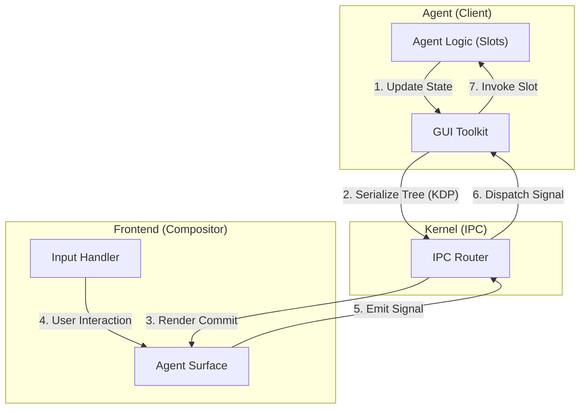

# Kairo Agent Native Rendering Specification

> **Status**: Draft
> **Version**: 0.3 (Qt-Wayland Architecture)
> **Related**: [AgentOS MVP](./agentos-mvp.md), [Global Event Bus](./global-event-bus-spec.md), [Human-AI Collaboration](./human-ai-collaboration.md)

## 1. 愿景与动机 (Vision & Motivation)

我们明确拒绝使用 HTML/Webview 作为 Agent 的渲染载体。
Agent Native Rendering (原生渲染) 的目标是构建一个**更直接、更安全、更简洁**的 GUI 系统。

受 **Qt Wayland** 架构的启发，我们重新定义 Kairo 的图形栈：
Kairo 不仅是一个操作系统，也是一个 **Compositor (合成器)**；Agent 不仅是逻辑处理单元，也是 **GUI Client (图形客户端)**。

这套系统是实现 [Human-AI Collaboration](./human-ai-collaboration.md) 中“共享空间”与“AI 空间”的基础。

---

## 2. 核心架构：Qt-Wayland 范式

我们采用了 Qt 的分层架构思想，将图形系统分为三层：

| Layer | Kairo Component | Qt Analogy | Description |
| :--- | :--- | :--- | :--- |
| **High-Level** | **Kairo GUI Toolkit** | Qt Widgets / QML | Agent 使用的高级声明式 UI 框架 |
| **Protocol** | **Kairo Display Protocol (KDP)** | Wayland Protocol | 极其精简的、基于 JSON/MsgPack 的传输协议 |
| **Low-Level** | **Kairo Compositor** | Qt Wayland Compositor | 运行在前端 Shell 中的合成器与窗口管理器 |

### 2.1 Kairo Compositor (The Server)
Kairo Shell 是一个 **Linux Wayland Compositor**，直接运行在 DRM/KMS 上（无 X11/GNOME 依赖）。
*   **Surface Management**: 管理每个 Agent 的绘图表面 (Surface)。
*   **Input Routing**: 直接通过 `libinput` 读取硬件输入并路由到 Surface。
*   **Composition**: 使用 OpenGL/Vulkan 直接向显卡提交 Buffer。

### 2.2 Kairo GUI Toolkit (The Client Library)
Agent 不应该直接操作底层的 Protocol。就像 Qt 开发者不直接写 Wayland 协议一样，Kairo Agent 使用一套高级的 **Widget Toolkit**。
*   **Declarative UI**: Agent 发送类似 **QML** 的描述结构（JSON Tree）。
*   **Signal/Slot**: Agent 监听 UI 组件的信号（如 `clicked`），并绑定到自身的槽函数（Action）。

---

## 3. 协议层：Kairo Display Protocol (KDP)

KDP 是 Compositor 和 Client 之间的通信语言。它定义了如何创建 Surface、提交 Buffer (Render Tree)、以及处理输入事件。

### 3.1 Render Engines (渲染引擎)

*   **Native Widgets (标准组件)**:
    *   提供基础原子组件：`Container`, `Column`, `Row`, `Text`, `Button`, `Image`, `TextInput`。
    *   布局模型：Flexbox (简化版)。
*   **Data Visualizer (数据可视化)**:
    *   专门的图表协议，支持：`LineChart`, `BarChart`, `PieChart`, `DataTable`。

### 3.2 信号与槽机制 (Signal & Slot Mechanism)

为了实现交互，我们借鉴 Qt 的信号槽机制。

*   **Signal**: UI 组件发出的事件（如 Button 的 `clicked`，Slider 的 `valueChanged`）。
*   **Slot**: Agent 定义的处理函数（即 Agent 的 Action）。

交互不再是简单的“事件回调”，而是**连接 (Connection)**。

```typescript
// Agent 声明 UI 时的连接描述
{
  type: "Button",
  properties: { label: "Deploy" },
  signals: {
    // 将 'clicked' 信号连接到 'deploy_service' 槽
    clicked: "deploy_service" 
  }
}
```

### 3.3 协议交互流 (Protocol Flow)



#### A. 提交 Surface 状态 (Commit)
Agent 发送 `render.commit` 事件。

```typescript
interface RenderCommitEvent {
  type: "kairo.agent.render.commit";
  data: {
    surfaceId: string;
    tree: RenderNode; // 根节点，类似于 QML 对象树
  };
}

// 示例 RenderNode 结构 (类似 QML)
type RenderNode = {
  type: string;       // e.g., "Button", "Row"
  id?: string;        // e.g., "submitBtn"
  props: Record<string, any>;
  signals?: Record<string, string>; // Signal -> Slot ID
  children?: RenderNode[];
};
```

#### B. 信号分发 (Signal Dispatch)
Compositor 发送 `ui.signal` 事件。

```typescript
interface SignalEvent {
  type: "kairo.ui.signal";
  source: "user";
  data: {
    surfaceId: string;
    signal: string;   // e.g., "clicked", "textChanged"
    slot: string;     // e.g., "deploy_service"
    args: any[];      // 信号携带的参数
  };
}
```

---

## 4. 详细设计场景 (Detailed Design)

### 4.1 场景一：DevOps 监控面板
Agent 需要展示服务器 CPU 负载。
1.  **Agent (Client)**: 使用 Toolkit 构建包含 `LineChart` 的 UI 树。
2.  **Commit**: 发送初始 UI。
3.  **Update**: 就像 Qt 的 `setProperty` 一样，Agent 只需要发送属性变更（Partial Update），Compositor 负责重绘。

### 4.2 场景二：交互式配置向导
Agent 需要用户填写参数。
1.  **Agent (Client)**: 构建包含 `TextInput`, `Button` 的 UI。
2.  **Connect**: 将 Button 的 `clicked` 信号连接到 Agent 的 `handle_submit` 槽。
3.  **Input**: 用户点击 Submit，Compositor 发送 Signal。
4.  **Slot**: Agent 的 `handle_submit` 被触发，读取输入参数并执行。

---

## 5. 安全性与隔离 (Security & Isolation)

Wayland 架构的核心优势在于安全性，Kairo 严格继承这一点：

1.  **无权访问剪贴板**: 默认情况下，Agent 的 UI 无法自动读写系统剪贴板。
2.  **无权截图**: Agent 无法请求“获取当前屏幕像素”，只能知道自己 Surface 的状态。
3.  **焦点保护**: 只有当 Surface 处于激活（Focused）状态时，才能接收键盘事件。
4.  **无脚本注入 (No XSS)**: 由于不使用 HTML/JS，而是使用声明式 JSON 树，彻底根除了 XSS 攻击的可能性。

## 6. 路线图 (Roadmap)

- **Phase 1 (MVP)**:
    - 实现 `Native Widgets` 协议（支持 Text, Button, Input, MarkdownContainer）。
    - 前端实现基础 Compositor。
- **Phase 2**:
    - 实现类似 **QML** 的 JSON DSL 解析器。
    - 实现 Signal/Slot 路由机制。
- **Phase 3**:
    - 引入 **Layout Constraints**: 允许 Agent 声明响应式布局规则。
