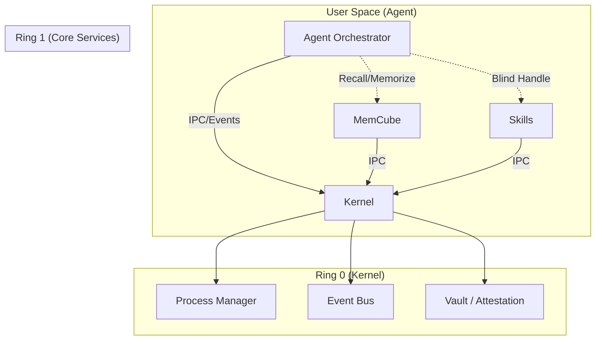

# [DEPRECATED] Kairo AgentOS MVP v0.2 (Memory & Secure Orchestration)

> **NOTICE**: This document is deprecated. Please refer to [agentos-mvp.md](./agentos-mvp.md) for the latest consolidated specification.

# Kairo AgentOS MVP v0.2 (Memory & Secure Orchestration)

> **Status**: Draft
> **Predecessor**: [agentos-mvp-v0.1.md](./agentos-mvp-v0.1.md)
> **New Core Modules**: [memcube-spec.md](./memcube-spec.md), [盲盒编排.md](./盲盒编排.md)

## 1. 演进目标 (Evolution Goals)

v0.1 确立了 "Process IO + IPC Push" 的内核底层原语。
v0.2 的核心任务是将 Kairo 从“无状态执行器”升级为**“具备长期记忆与安全边界的智能体操作系统”**。

新增两大核心能力：
1.  **MemCube 集成 (The Hippocampus)**：引入分层记忆系统，使 Agent 具备跨会话的上下文能力。
2.  **盲盒编排 (Blind Box Orchestration)**：引入“安全句柄 (Secure Handle)”与“内核级原本性校验 (Attestation)”，实现 Agent 对敏感能力的“零接触”编排。

## 2. 架构调整概览 (Architecture Updates)



### 2.1 新增 Ring 1：Core Services
v0.1 中所有能力都是“二进制 Skill”。v0.2 引入 **Core Services** 概念：
- **定义**：由 Kernel 托管生命周期、具有特权 IPC 通道、提供系统级能力的常驻服务。
- **首个实例**：**MemCube**。它不只是一个 Tool，而是 OS 的“海马体”，拥有独立的 IPC 命名空间 (`memory.*`)。

### 2.2 内核增强：Vault & Attestation
- **ProcessManager 升级**：在 spawn 进程时，注入 `RUNTIME_TOKEN`。
- **IPC Server 升级**：实现“内核指纹校验” (PID + Binary Hash + Token)，确保 `Skill_UID` 不被冒用。

## 3. 新增原语 (New Primitives)

### 3.1 原语 7：Memory Operations (MemCube IPC)
Kernel 暴露标准的记忆交互接口，Agent 无需关心底层是 LMDB 还是 HNSW。

**IPC Method**: `memory.interact`
```ts
type MemoryInteraction = {
  op: "add" | "recall" | "forget";
  content: string;
  meta: {
    layer?: "L1" | "L2" | "L3"; // 可选，默认自动路由
    importance?: number;
    context?: any;
  };
}
```

**事件流集成**：
- Agent 的 `thought` 和 `action` 自动流入 L1 (Working Memory)。
- 重要的 `tool.result` (如用户明确反馈) 触发 L2 固化。

### 3.2 原语 8：Secure Handle (Blind Box)
Agent 不再直接处理敏感数据（如 API Key、私钥），而是传递 **Handle**。

**Handle 结构**:
```ts
type SecureHandle = {
  $handle: string;       // "sh_vault_123456"
  scope: "session" | "persistent";
  resourceType: string;  // "image/png", "auth/credential"
}
```

**工作流**：
1.  **Auth Skill** 登录成功，返回 `{ "token": { "$handle": "sh_123" } }` 给 Agent。
2.  Agent 收到 Handle，但无法读取真实 Token。
3.  Agent 调用 **API Skill**，将 `sh_123` 作为参数传入。
4.  **API Skill** 向 Kernel (Vault) 兑换 `sh_123`，Kernel 校验 Skill 签名与权限后，将真实 Token 注入 Skill 进程内存（或通过加密通道传递）。

## 4. Agent 生命周期调整 (The Stateful Loop)

Agent 的主循环从 `Observe -> Act` 升级为 `Observe -> Recall -> Plan -> Act -> Memorize`。

### 4.1 Recall (回溯)
在响应用户输入前，Agent **必须** 先查询 MemCube：
- **Query**: 当前用户输入 + 近期会话摘要。
- **Result**: 相关历史偏好、类似任务的经验教训 (L2/L3)。

### 4.2 Blind Planning (盲编排)
Agent 在规划时，需识别哪些参数是“敏感的”，并预期它们以 Handle 形式存在。
- **约束**：Agent 不得尝试对 Handle 字符串进行 split/substring 等操作。

### 4.3 Memorize (记忆)
任务结束或关键节点时，Agent 主动触发 `memory.add`（或通过配置让 Kernel 自动采集）。

## 5. 模块职责边界 (Module Responsibilities)

### 5.1 Kernel (Core)
- **新增**：`SecurityMonitor`。负责在 IPC 请求时校验 `SO_PEERCRED` (Linux) 或进程信息，验证调用方身份。
- **新增**：`HandleManager`。管理 Handle 的生命周期与映射表。

### 5.2 MemCube (Service)
- **职责**：实现 [memcube-spec.md](./memcube-spec.md) 中的所有逻辑（分层、衰减、RRF 检索）。
- **运行态**：作为独立子进程运行，通过 IPC 暴露服务。

### 5.3 Skills (Extensions)
- **Manifest 更新**：增加 `security_level` 字段。
- **SDK 更新**：集成 `VaultClient`，支持自动解析 Handle。

## 6. v0.2 验收标准 (Acceptance Criteria)

1.  **记忆闭环**：
    - Agent 重启后，能通过 `memory.recall` 找回上一次会话告知的用户名字/偏好。
    - 验证 L1 记忆在 1 小时后（或模拟时间后）失效，L2 记忆持久化。
2.  **盲盒防御**：
    - 启动一个恶意 Skill (伪造 UID)，尝试调用 Vault 获取 Handle 对应的值，内核应拒绝并触发 `security.violation` 事件。
    - 合法 Skill 能通过 Handle 成功获取数据。
3.  **兼容性**：
    - v0.1 的 `process.spawn` 依然工作，但无 Handle 支持。

## 7. 迁移指南 (Migration Guide)

- **Config**: 需要配置 MemCube 的存储路径。
- **Agent Prompt**: 更新 System Prompt，教导 Agent 主动使用 `memory` 工具，并理解 Handle 的概念（“不要试图通过 print 打印 Handle 的内容”）。
