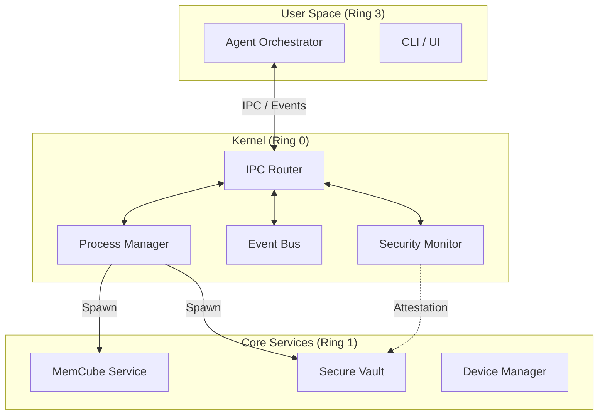

# Kairo AgentOS MVP Architecture Specification

> **Status**: Approved for Development
> **Version**: 1.0 (Consolidated MVP)
> **Supersedes**: `agentos-mvp-v0.1.md`, `agentos-mvp-v0.2.md`
> **Reference Specs**: [MemCube](./memcube-spec.md), [Blind Orchestration](./盲盒编排.md)

## 1. 核心愿景 (Vision)

Kairo AgentOS 的目标是构建一个**专为 AI Agent 设计的操作系统内核**。
不同于传统 OS 仅管理计算资源，AgentOS 将**记忆 (Memory)**、**意图 (Intent)** 和**安全凭证 (Credentials)** 也提升为内核级的一等公民（First-Class Citizens）。

**MVP 核心能力定义：**
1.  **全双工进程通信**：支持与任意二进制程序（FFmpeg, Python 脚本等）进行流式交互。
2.  **原生记忆系统**：内核内置分层记忆（MemCube），Agent 具备跨会话的长期记忆。
3.  **盲盒安全编排**：通过安全句柄（Secure Handle）机制，实现 Agent 对敏感凭证的“零接触”使用。
4.  **事件驱动架构**：无状态机设计，一切行为基于事件流（Event Sourcing）。

---

## 2. 系统架构 (System Architecture)

系统采用 **Ring 架构模型**，明确核心与扩展的边界。

### 2.1 Ring 0: Kernel (内核层)
- **Process Manager**: 负责进程生命周期 (spawn/kill/pause)，提供标准 IO 管道。
- **Event Bus**: 全局神经系统，负责事件的分发、持久化与回放。
- **IPC Router**: 基于 MsgPack 的高效 RPC 通道，支持流式推送 (Stream Push)。
- **Security Monitor**: 负责权限校验 (Permissions) 与 身份原本性证明 (Attestation)。

### 2.2 Ring 1: Core Services (核心服务层)
- **MemCube (海马体)**: 提供记忆存储、检索与遗忘服务。
- **Vault (保险箱)**: 管理敏感凭证，发放与验证安全句柄。
- **Device Manager**: 管理物理设备连接与 HAL。

### 2.3 Ring 3: User Space (用户空间)
- **Agent**: 纯粹的决策器。它不持有状态，不接触明文密码，通过消费事件和调用内核工具来工作。
- **Skills**: 具体能力的提供者（如 PDF 解析、网页浏览），运行在独立的沙箱进程中。

---

## 3. 内核原语 (Kernel Primitives)

内核向 Agent 暴露以下八大核心原语，构成 AgentOS 的“系统调用 (Syscalls)”。

### 3.1 进程与 IO (Process & IO)
*   **Process Session**: 进程不再是一次性的命令，而是可观测的会话对象。
*   **Stdio Streams**:
    *   `stdin.write`: 支持向运行中进程写入文本/二进制。
    *   `stdout/stderr`: 支持按 **Chunk** (字节流) 或 **Line** (行) 订阅。
    *   **Backpressure**: 内核对高速输出进行流控，避免撑爆 Agent 内存。

### 3.2 IPC 通信 (IPC & Push)
*   **Request/Response**: 标准 RPC 调用。
*   **Push Events**: 服务端主动推送 `EVENT` (状态变更) 和 `STREAM_CHUNK` (实时日志)。
*   **Introspection**: 支持查询当前支持的 API 列表与 Schema。

### 3.3 记忆操作 (Memory Ops)
*   **Recall (回忆)**: `memory.recall(query)`，基于语义、时间和关联性检索上下文。
*   **Memorize (记住)**: `memory.add(content)`，显式存入工作记忆；重要信息自动晋升为长期记忆。
*   **Forget (遗忘)**: 基于遗忘曲线自动清理，或主动删除。

### 3.4 安全句柄 (Secure Handles)
*   **Handle**: 格式如 `sh_vault_12345` 的字符串，代表一个敏感资源。
*   **Attestation**: 内核在 Skill 兑换 Handle 时，校验调用进程的 PID、Binary Hash 和 Runtime Token，确保不被伪造。

### 3.5 协作原语 (Collaboration Ops)
*   **Window Management**: `window.create(type, content, options)` 创建协作窗口。
*   **Sharing**: `window.share(content, target)` 将内容推送到共享空间。
*   **Focus**: `window.focus(range, reason)` 标记关注区域。
*   **Collaborative Edit**: `collab.edit(target, changes, intent)` 带意图的编辑。
*   **Conflict Resolution**: `collab.resolve(conflict_id, resolution)` 解决冲突。

---

## 4. Agent 生命周期 (The Stateful Loop)

在 MVP 中，Agent 的工作流被重新定义为 **"Recall-Plan-Act-Memorize"** 循环。

1.  **Observe (观察)**: 收到 `user.message` 或 `system.event`。
2.  **Recall (回溯)**:
    *   调用 `memory.recall` 查询相关历史（如：“用户上次说偏好什么格式？”）。
    *   获取当前上下文（L1 Working Memory）。
3.  **Plan (盲编排)**:
    *   根据输入和记忆规划下一步。
    *   **关键约束**：如果涉及敏感操作（如登录），仅传递 Handle，不处理 Token。
4.  **Act (行动)**:
    *   调用工具或系统能力（如 `process.spawn`）。
    *   产生 `agent.action` 事件。
5.  **Memorize (记忆)**:
    *   将行动结果、用户反馈存入记忆系统。
    *   如果是重要里程碑，触发 L2 固化。

---

## 5. API 规范摘要 (API Summary)

### 5.1 System / Kernel
- `kernel.ping()`: 健康检查。
- `system.get_metrics()`: 获取系统负载。

### 5.2 Process Management
- `process.spawn(cmd, args, options)`: 启动进程（支持注入 Handle）。
- `process.kill(pid)` / `process.signal(pid, signal)`: 终止/信号。
- `process.stdin.write(pid, data)`: 写入输入。
- `process.subscribe(pid, stream_type)`: 订阅输出流。

### 5.3 Memory (MemCube)
- `memory.add(content, meta)`: 写入记忆。
- `memory.recall(query, options)`: 混合检索。
- `memory.consolidate()`: 触发记忆整理（可选）。

### 5.4 Security (Vault)
- `vault.store(key, value)`: (仅限授权 Admin) 存入秘密。
- `vault.resolve(handle)`: (仅限授权 Skill) 兑换秘密。

---

## 6. 开发路线图 (Implementation Roadmap)

### Phase 1: 内核基座 (Kernel Foundation)
- [ ] **IPC 增强**: 实现 Server-side Push (`STREAM_CHUNK`)。
- [ ] **Process Manager**: 实现 Stdio 的全双工读写与流控。
- [ ] **Event Bus**: 确立 correlationId/causationId 的透传机制。

### Phase 2: 核心服务 (Core Services)
- [ ] **MemCube**: 集成 LMDB + HNSW，实现基础的 `add/recall`。
- [ ] **Vault**: 实现基础的 Handle 生成与内存映射注入。
- [ ] **Security**: 在 spawn 流程中加入 Runtime Token 注入。

### Phase 3: Agent 集成 (Agent Integration)
- [ ] **Runtime**: 升级 Agent Loop，加入 Recall 环节。
- [ ] **Tooling**: 适配标准工具库，使其支持 Handle 参数。
- [ ] **Verification**: 端到端测试（启动 Agent -> 记忆回溯 -> 盲盒调用 -> 任务完成）。

---

## 7. 验收标准 (Acceptance Criteria)

1.  **全链路通信**: Agent 能启动一个交互式 CLI 工具（如 Python REPL），写入代码并读取执行结果。
2.  **记忆持久化**: 重启 AgentOS 后，Agent 依然能回答“我上次让你做的是什么任务”。
3.  **安全隔离**: 即使 Agent 逻辑被攻破，攻击者也只能拿到 Handle 字符串，无法通过网络外泄真实 API Key（因网络权限被沙箱限制，且 Key 仅在受信任 Skill 内存中存在）。
