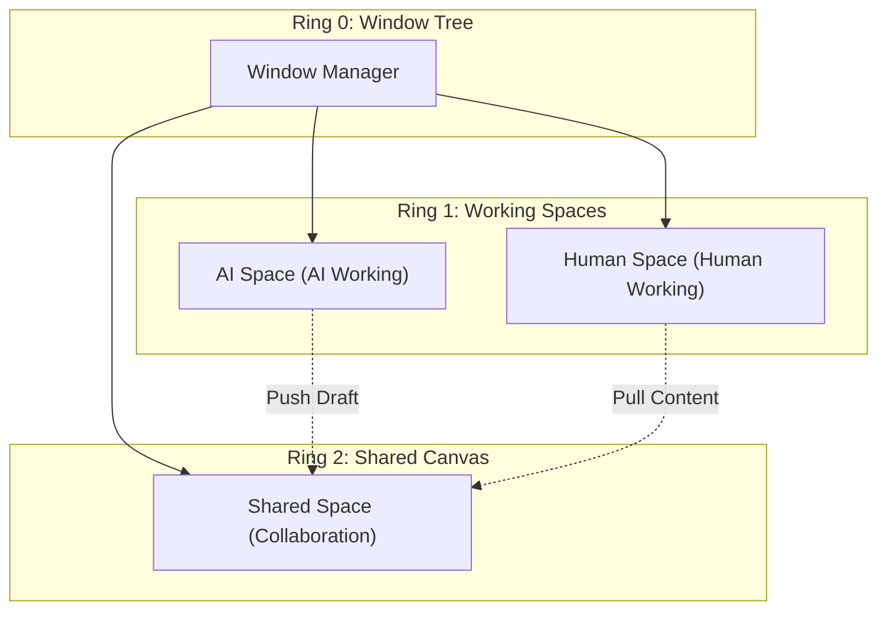

# Kairo Human-AI Collaboration Specification

> **Status**: Draft
> **Version**: 0.1
> **Related**: [AgentOS MVP](./agentos-mvp.md), [Agent Native Rendering](./agent-native-rendering.md)

## 1. 核心愿景 (Vision)

Kairo 架构中最具想象力的一环：AI 原生操作系统的交互范式不是“人用 AI”，也不是“AI 替人”，而是 **人机协作 (Human-AI Collaboration)**。

我们提出了 **基于意图的协作空间 (Intent-based Collaboration Space)**，打破了传统单一窗口的限制，构建了一个三层协作模型。

---

## 2. 核心概念：协作窗口的“三层空间”



### 2.1 AI 空间 (AI Working Memory)
- **控制者**: AI 完全控制。
- **可见性**: 用户可选查看（默认折叠）。
- **用途**: AI 的内部思考、草稿、备选方案推演。
- **交互**: 用户不能直接编辑，但可以“拉取 (Pull)”内容到共享空间。

```typescript
// Agent Action Example
agent.action({
  type: "window.ai_working",
  content: {
    reasoning: "用户想分析销售数据，我有三个方案...",
    draft: "初步分析结果...",
    alternatives: ["方案A", "方案B"]
  },
  visibility: "optional"
})
```

### 2.2 人空间 (Human Working Memory)
- **控制者**: 用户完全控制。
- **用途**: 用户的私人笔记、草稿、思考。
- **权限**: AI 无权读取（除非用户主动分享）。
- **意义**: 给用户一个“不被打扰”的私人空间，保护隐私与思考的独立性。

### 2.3 共享空间 (Shared Canvas)
- **控制者**: 人与 AI 共同控制（双向可编辑）。
- **用途**: 协作的核心区域，最终成果的产出地。
- **核心机制**: **版本感知** 和 **意图对齐**。

```typescript
// Shared Canvas Object
{
  id: "canvas_123",
  content: "正在写的报告...",
  history: [
    { version: 1, author: "human", delta: "..." },
    { version: 2, author: "ai", delta: "..." },
    { version: 3, author: "human", merge: true }
  ],
  conflicts: []
}
```

---

## 3. 核心协作机制 (Core Mechanisms)

### 3.1 意图对齐 (Intent Alignment)
当 AI 在共享空间修改内容时，它必须声明**意图**，而不仅仅是提交 diff。

```typescript
agent.action({
  type: "shared_canvas.edit",
  target: "canvas_123",
  changes: [
    { range: [10, 20], text: "新的段落..." }
  ],
  intent: {
    goal: "clarify_technical_term",
    reasoning: "用户之前不理解这个概念，我加个解释",
    confidence: 0.85
  }
})
```
用户界面上会显示：“AI 修改了这段，因为...” (Accept/Reject/Modify)。

### 3.2 版本感知 (Version Awareness)
人和 AI 并行工作时，通过 Operational Transformation (OT) 或 CRDT 算法处理冲突，或者显式地抛出冲突给用户解决。

```python
if change.base_version != self.current_version:
    conflict = { "yours": change, "theirs": self.pending_changes }
    self.notify_human("conflict", conflict)
```

### 3.3 角色感知 (Role Awareness)
同一份数据，人和 AI 看到不同的视图。
- **AI 视图**: 包含原始数据、元数据、置信度、阈值。
- **用户视图**: 经过渲染的、简洁的、 actionable 的信息。

### 3.4 焦点同步 (Focus Synchronization)
一方的关注点（光标位置、选区）对另一方可见。
- AI 可以在用户写代码时，高亮它认为有问题的行（不直接改，先提示）。
- 用户可以在阅读文档时，选中一段，AI 自动感知并准备解释。

---

## 4. 协作生命周期 (Lifecycle)

1.  **AI 提议**: AI 在 AI 空间起草 -> 用户瞥见 -> 决定拉入共享空间。
2.  **共同编辑**: 双向编辑 + 意图对齐 + 版本控制 + 焦点同步。
3.  **分歧解决**: 冲突发生 -> 系统标记差异 -> 用户仲裁。
4.  **成果固化**: 双方满意 -> 存档/导出 -> 或推回 AI 空间作为新记忆。

---

## 5. 区别 (Comparison)

| 维度 | 现有 AI 应用 | Kairo 协作窗口 |
|------|-----------|--------------|
| **交互模式** | 你问我答 (Turn-based) | 我们一起工作 (Co-working) |
| **窗口** | 单窗口，AI 替你做 | 多窗口，AI 和你一起做 |
| **编辑** | AI 生成，你修改 | 双向可编辑，意图可见 |
| **冲突** | 要么听 AI，要么不听 | 协商解决，版本感知 |
| **隐私** | AI 能看到一切 | 人有私人空间 |
