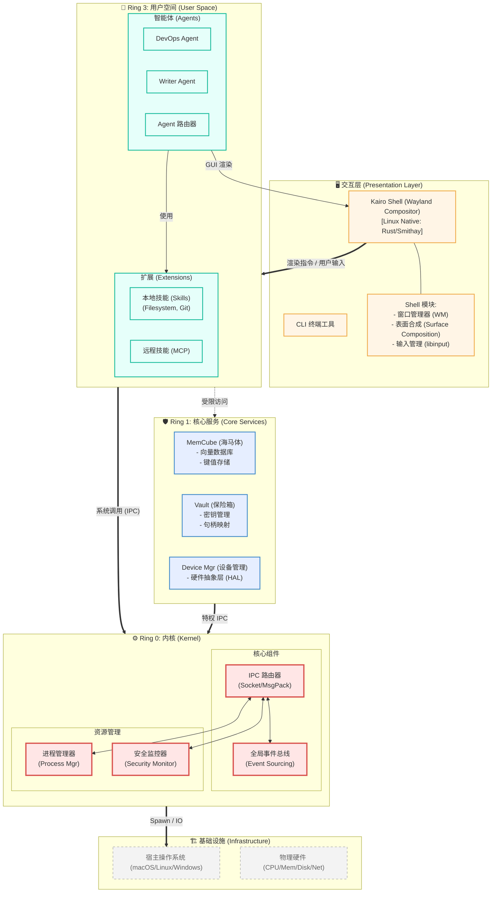

# Kairo AgentOS 系统架构图 (System Architecture Diagram)

本文档展示了 Kairo AgentOS 的静态分层架构（Ring Model）。与关注数据流的[运行时架构图](./system-runtime-diagram.md)不同，本图侧重于展示系统的**层级结构**、**模块边界**与**包含关系**。

## 环形架构模型 (The Ring Model)

Kairo 采用类似操作系统内核的 Ring 架构，将系统划分为三个特权层级。

## 架构层级详解

### 1. 交互层 (Presentation Layer)
这是用户“看到”的部分。
*   **Kairo Shell**: 相当于桌面环境 (Desktop Environment)。它不产生内容，只负责**展示** Ring 3 中 Agent 生成的内容，并捕获用户输入。
*   **CLI**: 供开发者或无头模式使用的命令行接口。

### 2. Ring 3: 用户空间 (User Space)
这是业务逻辑发生的地方，也是生态扩展的层级。
*   **Agents**: 纯粹的逻辑单元。它们没有“身体”（不直接持有文件句柄或密钥），完全通过发送指令（Events/IPC）来工作。
*   **Skills**: 实际干活的工具。运行在沙箱进程中，由 Agent 编排。

### 3. Ring 1: 核心服务 (Core Services)
这是 Kairo 的“增强组件”，提供了传统 OS 没有的高级能力。
*   **MemCube**: 系统的长期记忆存储。
*   **Vault**: 系统的安全凭证保管库。
*   **Device Manager**: 统一管理摄像头、麦克风、GPIO 等硬件资源。

### 4. Ring 0: 内核 (Kernel)
这是 Kairo 的心脏，负责最底层的资源调度与通信。
*   **IPC Router**: 神经中枢，所有跨进程通信都必须经过它。
*   **Event Bus**: 系统的“意识流”，记录所有发生过的事件。
*   **Process Manager**: 负责启动、停止、监控所有 Ring 3 和 Ring 1 的进程。
*   **Security Monitor**: 负责校验权限，确保 Ring 3 的组件不能越权访问 Ring 1 或 Ring 0。
