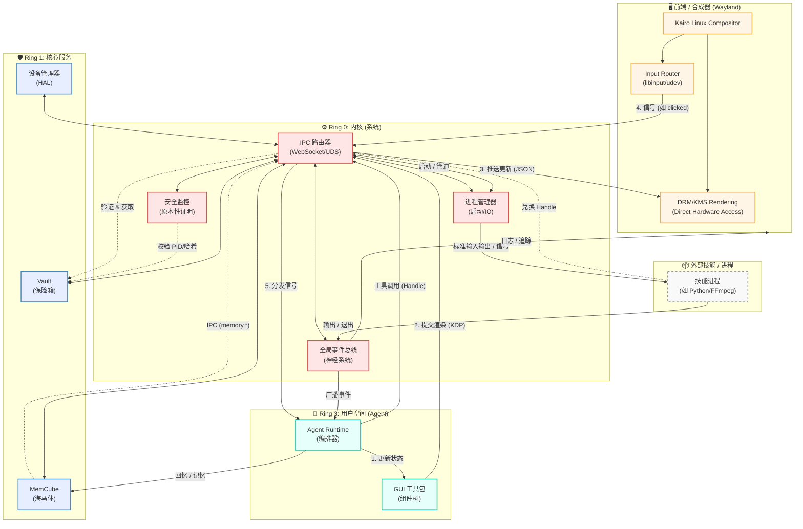

# Kairo AgentOS 系统运行时架构图 (System Runtime Diagram)

本文档提供了 Kairo AgentOS 运行时架构的全面可视化展示，集成了内核 (Ring 0)、核心服务 (Ring 1)、用户空间 (Ring 3) 和前端合成器 (Frontend Compositor)。

## 运行时架构概览

## 关键流程说明

1.  **渲染循环 (Qt-Wayland 风格)**
    *   **Agent** 更新其内部状态并使用 **GUI Toolkit** 生成 `RenderNode` 树。
    *   工具包通过 **IPC** 发送 `kairo.agent.render.commit` 事件。
    *   **IPC 路由器** 将此更新推送到 **前端合成器 (Compositor)**。
    *   用户交互由 **输入路由 (Input Router)** 捕获，并作为 `kairo.ui.signal` 事件发回给 Agent。

2.  **认知循环 (记忆)**
    *   在行动之前，Agent 通过 IPC 调用 `memory.recall` 从 **MemCube** 获取上下文。
    *   行动之后，Agent 调用 `memory.add` 存储结果。
    *   **MemCube** 作为核心服务运行，管理向量存储和键值存储。

3.  **安全执行 (盲盒)**
    *   Agent 将 **安全句柄 (Secure Handle)** (如 `sh_123`) 传递给技能，而不是原始密钥。
    *   **进程管理器** 启动技能进程。
    *   技能请求兑换句柄。
    *   **安全监控 (Security Monitor)** 验证技能的身份 (PID, 二进制哈希)。
    *   **Vault (保险箱)** 将密钥直接释放到技能的内存中。

4.  **事件系统**
    *   所有系统状态变更 (进程 IO、工具结果、用户消息) 都流经 **全局事件总线**。
    *   Agent 订阅相关事件以驱动其决策循环。
