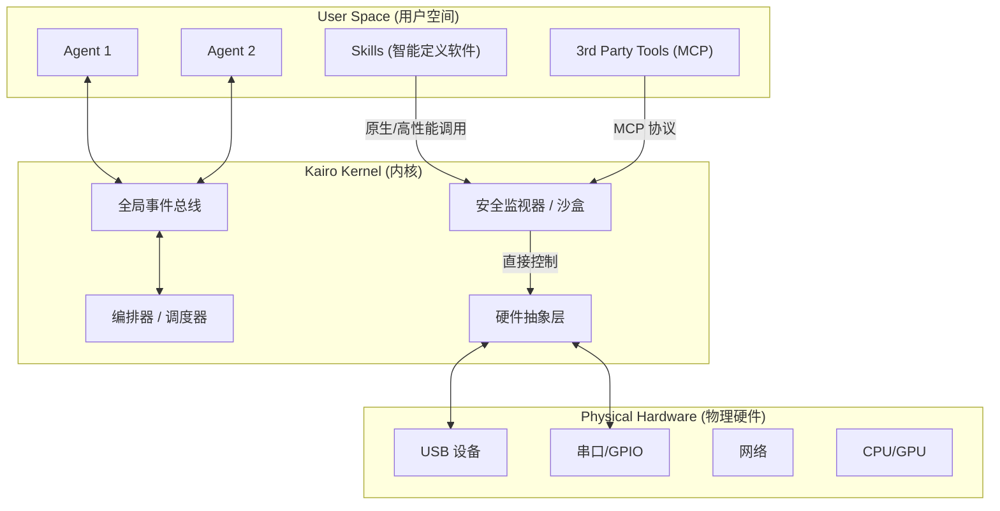

# Kairo: 从 Agent Runtime 到 Agent OS

## 1. 愿景 (Vision)
Kairo 正在从一个 LLM Agent 运行时环境演进为一个完全成熟的 **Agent OS（智能体操作系统）**。我们的目标是赋予 Agent 超越文本处理的能力，使其能够 **与物理世界交互**、**管理系统资源**，并通过软件定义来 **扩展自身能力**。

在这个愿景中：
- **Agent (智能体)** 是系统的一等公民（类似于传统 OS 中的进程）。
- **Skills (技能)** 是 **智能定义软件 (Intelligence Defined Software)** 的体现。它们不仅仅是脚本，而是由智能体根据需求动态调用、编排甚至生成的软件单元（可能包含高性能二进制程序），用于定义系统如何与物理或数字世界交互。
- **Kairo Core** 是内核（Kernel），负责硬件抽象、安全控制和资源调度。内核的统一和底层实现 **不依赖 MCP (Model Context Protocol)**，而是采用原生、高效的内部协议。

## 2. 架构概览 (Architecture Overview)



## 3. 核心原则：内核 vs 扩展 (Core Principles)

### 3.1. 内核统一 (Kernel Unification)
Kairo Kernel 负责系统的核心统一性，但这 **不是** 通过 MCP 实现的。
*   **原生实现**: 内核功能（如进程管理、内存管理、硬件驱动加载）使用原生代码（TypeScript/Rust/C++）直接实现，以确保最高性能和最低延迟。
*   **内部协议**: 内核组件之间通过高效的内存对象或系统级 IPC 通信，而不是基于 JSON-RPC 的 MCP。
*   **为何不用 MCP 做内核?**: MCP 是为连接 **外部**、**异构** 和 **第三方** 工具设计的协议。对于操作系统内核而言，它过于松散且开销较大。

### 3.2. MCP 的定位 (Role of MCP)
MCP 在 Agent OS 中依然重要，但其定位是 **外围扩展接口**。
*   **第三方工具**: 只有当接入非 Kairo 原生管理的第三方服务（如 Google Drive, Slack, GitHub）时，才使用 MCP。
*   **松耦合**: 适用于那些不需要实时控制硬件、对延迟不敏感的场景。

### 3.3. 技能即智能定义软件 (Skills as Intelligence Defined Software)
"Skill" 是 Kairo 的核心应用格式，它代表了 **智能定义软件**。
*   **智能主导**: 软件（代码/二进制）不再是静态的工具，而是智能体（Intelligence）意志的延伸。智能体根据当前的任务环境，决定使用、配置或组合哪些软件模块。
    *   **二进制程序**: 编译好的可执行文件（如信号处理算法、驱动程序 wrapper）。
    *   **AI 模型**: 专用的轻量级推理模型。
    *   **控制逻辑**: 复杂的业务流程。
*   **接管能力**: 高级技能可以“接管”特定的物理接口（如通过二进制程序直接控制 SDR 硬件），这需要内核级的权限调度，而不是简单的 API 调用。

## 4. 核心组件 (Core Components)

### 4.1. 硬件抽象层 (HAL)
为了让 Agent 能够“接管物理接口”，我们需要一个统一的层来管理硬件访问。

*   **设备注册表 (Device Registry)**: 动态维护可用设备列表（USB、蓝牙、串口、摄像头等）。
*   **标准接口 (Standard Interfaces)**:
    *   `serial`: COM 端口的读/写流。
    *   `gpio`: 数字 I/O 控制（用于 IoT 集成）。
    *   `camera`: 视频帧捕获流。
*   **访问控制**: Agent 必须请求权限才能访问特定设备。

**实现策略**:
*   创建一个新的领域 `src/domains/device`。
*   使用原生绑定（通过 Bun 或 Node FFI）直接对接硬件。
*   **严禁** 为了内部硬件访问而通过 MCP 绕道，必须提供内核级 API (Kernel System Calls)。

### 4.2. 二进制技能与执行环境
*   **二进制支持**: 技能包中包含针对目标架构（ARM64/x64）编译的二进制文件。
*   **生命周期管理**: 内核负责下载、校验签名、并在沙盒中启动这些二进制进程。
*   **高性能通道**: Agent 与二进制技能之间可以通过共享内存或管道（Pipe）进行通信，绕过标准文本协议的限制。

### 4.3. 安全与沙盒 (Security & Sandboxing)
*   **权限清单 (Permission Manifests)**:
    ```yaml
    permissions:
      - device: serial
      - capability: raw_socket
    ```
*   **用户许可 (User Consent)**: 关键操作触发内核级安全拦截。

## 5. 底层实现细节：构建在定制 Linux 之上 (Deep Dive)

Kairo 的强大不仅来自于上层架构，更来自于对 Linux 底层能力的深度整合。我们通过定制的 Linux 发行版（基于 Yocto 或 Buildroot）提供以下特殊能力：

| 链接方式 | 在定制 Linux 中的实现 | Agent OS 的特殊能力 |
| :--- | :--- | :--- |
| **PTY** | 预置 `tmux` 或 `screen` 协议栈 | **无限后台终端**：Agent 可以开启无限个后台终端，且内核自动记录所有操作日志供溯源。任务在会话断开后依然保持运行。 |
| **FFI** | 预置专门编译的 `.so` 库集合 | **原子技能库**：系统自带一组高性能动态库（如 OpenCV, FFmpeg, SQLite, TensorFlow Lite）。Agent 无需下载庞大的二进制，直接通过 FFI (Foreign Function Interface) 以纳秒级开销调用原生能力。 |
| **D-Bus** | 精简版 D-Bus 守护进程 | **硬件事件驱动**：屏蔽掉无关的桌面信号，只向 Kairo Kernel 转发关键的硬件生命周期事件（如“USB设备插入”、“电源不足”、“温度告警”）。 |
| **Socket** | 预设的内核通信管道 (Unix Domain Sockets) | **极速 IPC**：Agent (Bun Runtime) 与本地二进制工具之间的数据交换通过 UDS 进行，不经过 TCP/IP 协议栈，极大降低延迟（适用于视频流/高频传感器数据）。 |
| **Serial** | 自动绑定的 `udev` 规则 | **语义化设备路径**：无论物理 USB 插入哪个端口，系统根据 VID/PID 自动将其映射为固定的语义路径（如 `agent://tty_sensor`），Agent 无需猜测 `/dev/ttyUSBx` 编号。 |

## 6. 路线图 (Roadmap)

### 第一阶段：系统感知与内核基础
- [ ] 明确定义 Kernel API 规范（非 MCP）。
- [ ] 实现 `SystemInfo` 内部模块（Native Module）。

### 第二阶段：智能定义软件基础
- [ ] 更新 `Skill` 架构，支持二进制分发。
- [ ] 实现二进制程序的生命周期管理（启动/停止/监控）。

### 第三阶段：硬件接口接管
- [ ] 实现 `DeviceManager`，提供对物理端口的原生访问。
- [ ] 演示案例：通过 Agent 加载一个二进制技能来控制硬件设备。
