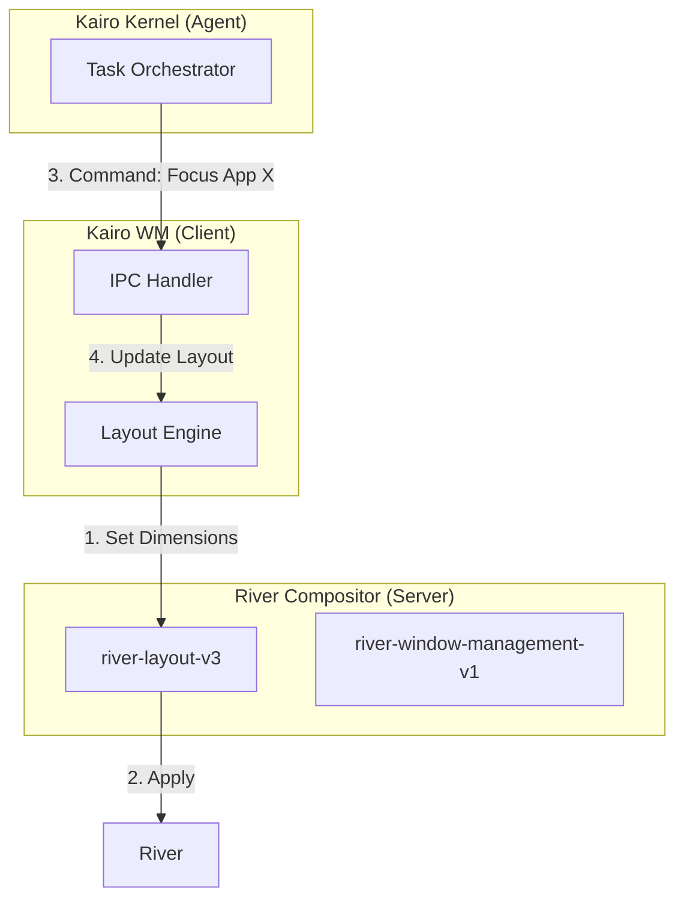

# Kairo Window Manager (Kairo WM) 规范

> **Status**: Draft
> **Language**: Zig
> **Protocol**: `river-window-management-v1`

## 1. 什么是 Kairo WM？

**Kairo WM** (`kairo-wm`) 是 Kairo AgentOS 的专用窗口管理器。

在 River 的架构中，**Compositor** (负责渲染、硬件管理) 与 **Window Manager** (负责布局逻辑) 是分离的。River 本身是一个 Compositor，而 `kairo-wm` 是一个运行在 River 之上的客户端程序，负责告诉 River "每个窗口应该摆在哪里"。

它是连接 **传统桌面逻辑** 与 **Agent 智能意图** 的桥梁。

## 2. 核心职责

### 2.1 动态平铺 (Dynamic Tiling)
它替代了 River 默认的 `rivertile`，提供一套适合 AI 辅助工作的平铺算法。
*   **Master/Stack 布局**: 屏幕左侧（或上方）为主工作区，右侧为堆叠区。
*   **智能调整**: 根据窗口的类型和 Agent 的上下文自动调整窗口大小。

### 2.2 Agent 协同 (Agent Coordination)
这是 Kairo WM 最独特的功能。它不仅仅管理普通的应用窗口，还负责为 Agent 的 UI 预留空间。

*   **Agent Panel 避让**: 当 Agent 面板（由 Compositor 的 Overlay 层渲染）展开时，Kairo WM 会收到通知（或通过 IPC），自动缩小其他应用窗口的可用区域 (Usable Area)，确保 Agent 面板不会遮挡应用内容，而是与应用“并排”显示。
*   **任务聚焦**: 当 Agent 启动一个应用来执行特定任务时（例如 "用 VS Code 写代码"），Kairo WM 会自动将该窗口最大化或置于 Master 区域。

### 2.3 工作区管理 (Tag Management)
River 使用 "Tags"（标签）而非传统的 Workspaces。`kairo-wm` 管理这些标签的语义。
*   **Tag 1**: 专注模式 (Focus) - Agent 当前操作的主窗口。
*   **Tag 2-9**: 后台应用或次要任务。
*   **自动打标**: 根据 Agent 的指令，将新打开的窗口自动分配到特定的 Tag。

## 3. 架构设计

`kairo-wm` 是一个独立的 **Zig** 可执行文件。

## 4. 布局模式 (Layout Modes)

### A. **Focus Mode (默认)**
*   **Agent**: 隐藏或收起为小图标。
*   **App**: 当前活动应用占据全屏或大部分屏幕。
*   适合：用户沉浸式工作（写代码、看视频）。

### B. **Co-Pilot Mode (协同)**
*   **Agent**: 占据屏幕左侧 30% ~ 40% 的宽度。
*   **App**: 自动重排到右侧剩余空间。
*   适合：Agent 正在协助用户，或用户正在与 Agent 对话。

### C. **Dashboard Mode (概览)**
*   所有窗口缩小并平铺 (Grid Layout)。
*   Agent 显示全局概览信息。

## 5. 接口定义 (IPC)

`kairo-wm` 暴露一个简单的 IPC 接口（可能是 Unix Socket 或 River 自带的 Command 系统），供 Kernel 调用。

*   `wm.set_mode(mode: "focus" | "copilot" | "dashboard")`
*   `wm.move_window(view_id, tag)`
*   `wm.reserve_space(edge: "left", pixels: 400)`: 请求为 Agent Panel 预留屏幕空间。

## 6. 开发计划

1.  **原型 (v0.1)**:
    *   基于 `rivertile` 源码进行修改。
    *   实现基本的 Master/Stack 布局。
    *   硬编码 "Agent Area" 的预留逻辑。

2.  **集成 (v0.2)**:
    *   接入 `kairo-kernel` 的控制信号。
    *   实现 Mode 切换动画（平滑过渡）。

3.  **高级 (v1.0)**:
    *   支持多显示器智能分配。
