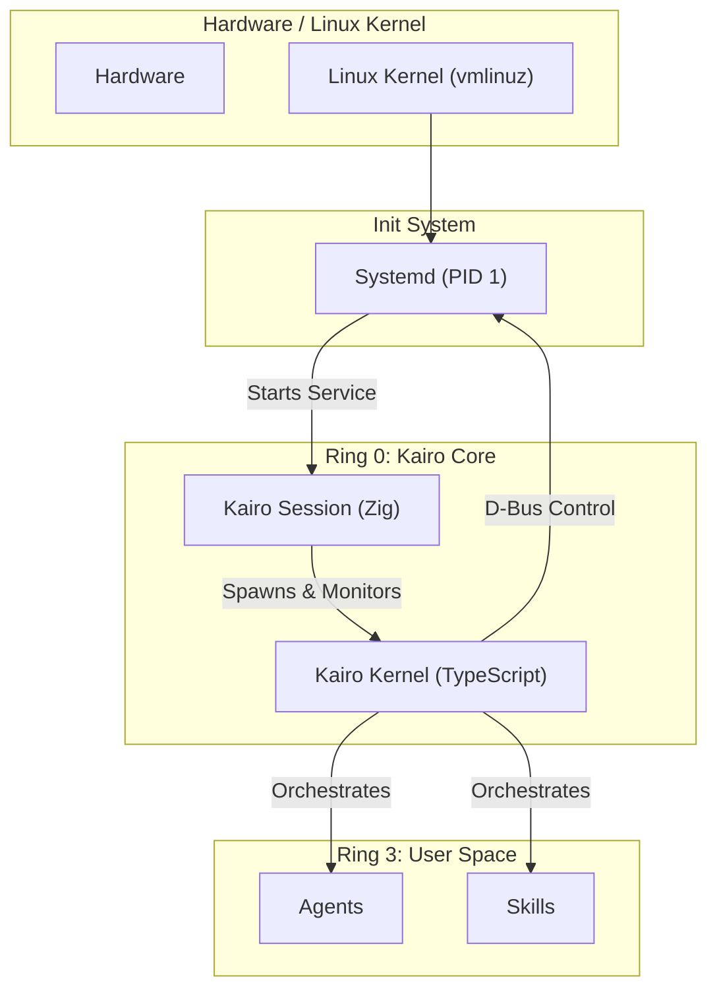

# Kairo Kernel Implementation Guide (Zig & TS)

本文档是 Kairo AgentOS 内核实现的入口指南。我们采用了双层内核架构：**Zig Session Manager** 和 **TypeScript Kernel (Runtime)**，并运行在标准的 Systemd 之上。

请参考以下详细文档获取具体规范和实现指南：

*   **[Kairo Session Manager (Zig) 功能规范](./zig_init_spec.md)**
    *   详细定义了 Zig 编写的会话管理器，作为 Systemd 服务运行，负责启动 TS Kernel 和图形栈。
*   **[Kairo Kernel (TS) 功能规范](./ts_kernel_spec.md)**
    *   详细定义了基于 Bun 的微内核逻辑，包括 IPC 协议、通过 D-Bus 集成 Systemd 以及设备驱动模型。

## 1. 双层内核架构 (Dual-Layer Kernel Architecture)

Kairo 的“内核”运行在标准 Linux 发行版（如 Debian/Arch）之上，保留 Systemd 作为 PID 1。

1.  **Kairo Session (Zig)**: 系统级守护进程，作为 Systemd Service 运行。
2.  **Kairo Kernel (TypeScript)**: 运行在 Bun 之上的核心逻辑层，通过 D-Bus 编排系统资源。

## 2. 职责分工概览

| 特性 | Systemd (PID 1) | Zig (Kairo Session) | TypeScript (Kairo Kernel) |
| :--- | :--- | :--- | :--- |
| **运行层级** | OS Init | System Service | Application Runtime |
| **主要任务** | 硬件初始化, 服务管理, 挂载 | 启动 Runtime, 启动 GUI, 看门狗 | IPC, 业务编排, D-Bus 控制 |
| **崩溃后果** | Kernel Panic | 服务重启 (Systemd 重新拉起) | Runtime 重启 (Zig 重新拉起) |

详细分工请参阅上述两个分规范文档。

## 3. 如何修改内核 (How to Modify)

### 3.1 修改 Zig Session Manager
请参考 **[Kairo Session Manager (Zig) 功能规范](./zig_init_spec.md)**。

简要工作流:
1.  编辑 `/os/src/main.zig`。
2.  在 `os/` 目录下运行 `zig build -Dtarget=x86_64-linux-musl`。
3.  替换 `/usr/bin/kairo-session` 并重启服务。

### 3.2 修改 TypeScript Kernel 层
请参考 **[Kairo Kernel (TS) 功能规范](./ts_kernel_spec.md)**。

简要工作流:
1.  在 `src/domains/kernel` 中修改 IPC 协议或 Manager 逻辑。
2.  Runtime 重启即可生效。

