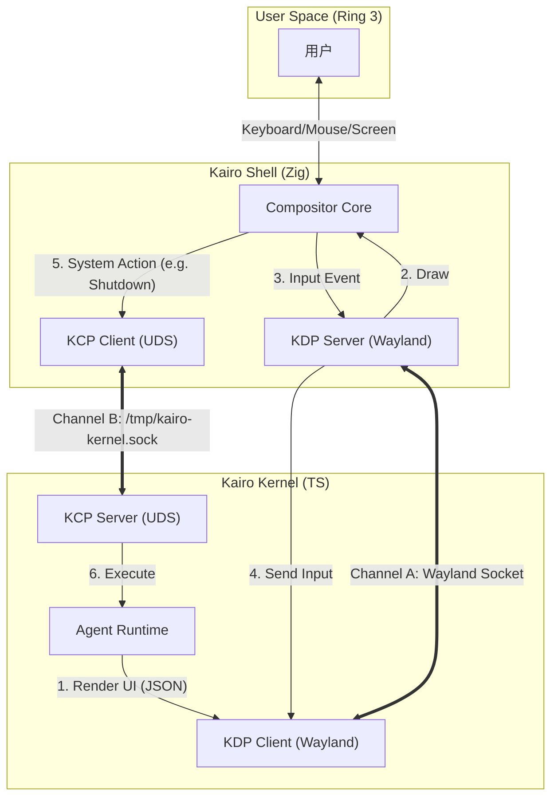
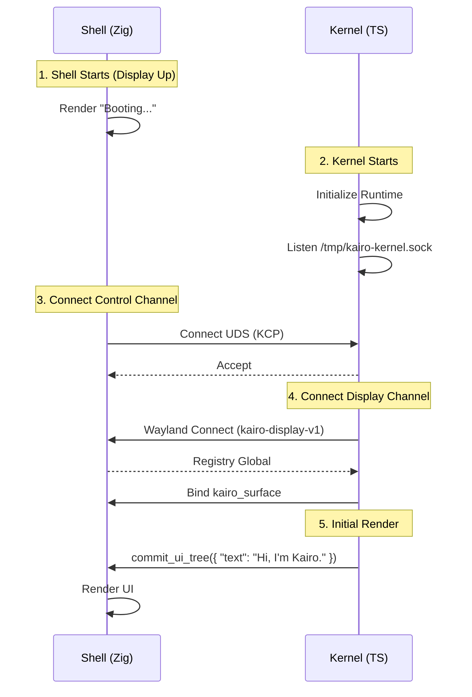
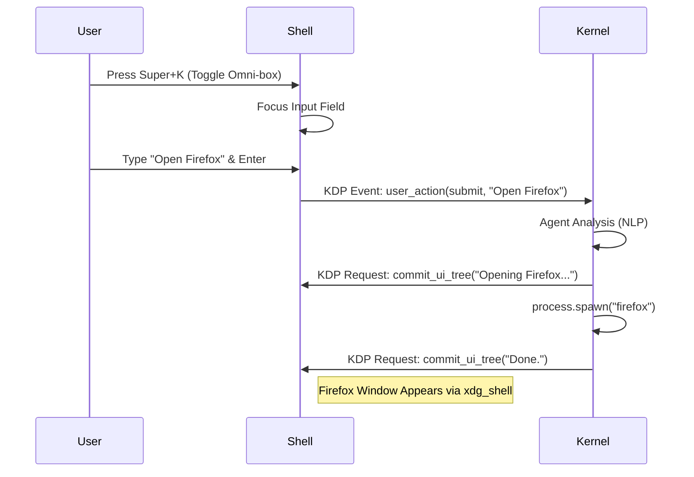

# Kairo Shell & Kernel 交互规范 (Interaction Spec)

> **Status**: Draft
> **Version**: 0.1
> **Last Updated**: 2025-02-15

本文档详细定义了 **Kairo Shell (Zig Compositor)** 与 **Kairo Kernel (TypeScript Runtime)** 之间的交互行为、通信协议及数据流转方式。

## 1. 架构概览 (Architecture Overview)

在 Kairo AgentOS 中，图形界面 (Shell) 与业务逻辑 (Kernel) 是完全解耦的两个独立进程，它们通过双向通道进行通信。

*   **Kairo Shell (Frontend)**:
    *   **角色**: Wayland Compositor (Server)。
    *   **职责**: 负责屏幕渲染、输入事件捕获、窗口管理 (Tiling)、应用合成。
    *   **技术**: Zig, River, wlroots。
*   **Kairo Kernel (Backend)**:
    *   **角色**: Wayland Client & System Orchestrator。
    *   **职责**: 运行 Agent 逻辑、生成 UI 树、管理系统状态、通过 D-Bus 控制系统服务。
    *   **技术**: TypeScript, Bun。

### 1.1 双通道通信模型 (Dual-Channel Model)

为了分离“渲染关注点”与“系统控制关注点”，我们使用两个独立的通信通道：

| 通道名称 | 协议栈 | 角色关系 | 用途 |
| :--- | :--- | :--- | :--- |
| **Channel A: KDP (Display)** | `Wayland` + `kairo-display-v1` | Kernel (Client) -> Shell (Server) | **UI 渲染与输入**。<br>Kernel 发送 UI 树，Shell 发送键盘/鼠标事件。 |
| **Channel B: KCP (Control)** | `Unix Domain Socket` + `MsgPack` | Shell (Client) -> Kernel (Server) | **系统控制与状态**。<br>Shell 请求关机、查询电池、获取当前 Agent 状态。 |



---

## 2. Channel A: Kairo Display Protocol (KDP)

KDP 是一个自定义的 Wayland 协议扩展 (`kairo-display-v1.xml`)。它允许 Kernel 将复杂的 UI 描述（类似于 React Virtual DOM）发送给 Shell 进行原生渲染。

### 2.1 协议定义 (Wayland XML 摘要)

```xml
<protocol name="kairo_display_v1">
  <interface name="kairo_surface" version="1">
    <!-- Kernel 发送 UI 树更新 -->
    <request name="commit_ui_tree">
      <arg name="json_payload" type="string" summary="Serialized UI Tree JSON"/>
    </request>

    <!-- Shell 发送用户交互事件 -->
    <event name="user_action">
      <arg name="element_id" type="string"/>
      <arg name="action_type" type="string" summary="click, submit, hover"/>
      <arg name="payload" type="string" summary="JSON data (e.g. input value)"/>
    </event>
  </interface>
</protocol>
```

### 2.2 数据流转：UI 渲染 (Kernel -> Shell)

1.  **生成**: Agent Runtime 决定更新界面（例如 Agent 输出了一段话）。
2.  **序列化**: Kernel 将 UI 状态序列化为 JSON 格式的 **Render Tree**。
3.  **传输**: Kernel 调用 `kairo_surface.commit_ui_tree(json)`。
4.  **解析**: Shell 收到 JSON，解析为内部的原生组件树 (Zig Structs)。
5.  **绘制**: Shell 使用 GPU (OpenGL/Vulkan) 将组件绘制在 Overlay 层上。

**JSON Payload 示例**:
```json
{
  "root": {
    "type": "flex",
    "direction": "column",
    "children": [
      {
        "type": "text",
        "content": "正在为您分析日志...",
        "style": { "color": "#ffffff", "fontSize": 16 }
      },
      {
        "type": "progress_bar",
        "value": 45
      }
    ]
  }
}
```

### 2.3 数据流转：用户输入 (Shell -> Kernel)

1.  **捕获**: 用户点击了 Shell 渲染的按钮，或在 Omni-box 中按下了回车。
2.  **映射**: Shell 根据坐标找到对应的 UI 元素 ID。
3.  **发送**: Shell 发送 `user_action` 事件。
    *   `element_id`: "input-box-main"
    *   `action_type`: "submit"
    *   `payload`: `{"text": "帮我打开 VS Code"}`
4.  **处理**: Kernel 收到事件，将其转换为 `kairo.user.message` 事件，进入 Agent 的事件循环。

---

## 3. Channel B: Kernel Control Protocol (KCP)

KCP 使用标准的 **Kernel IPC** 机制（详见 `kernel-ipc-spec.md`），基于 Unix Domain Socket。

### 3.1 连接建立
*   **Server**: Kernel 监听 `/tmp/kairo-kernel.sock`。
*   **Client**: Shell 启动时尝试连接该 Socket。如果连接失败（Kernel 尚未启动），Shell 应显示“系统启动中...”并重试。

### 3.2 常用交互场景

#### 场景 A: 窗口平铺控制 (Smart Tiling)
当 Kernel 启动一个 GUI 应用（如 VS Code）时，它需要通知 Shell 如何布局。

1.  **Kernel**: `process.spawn("code")`。
2.  **Kernel** -> **Shell** (通过 KDP 或 KCP): 发送布局意图 (Layout Intent)。
    *   *注：Wayland 本身有 `xdg_shell` 协议处理窗口创建，但 Shell 需要知道这个窗口是 "Agent 启动的"，从而给予特殊布局处理。*
    *   **机制**: Kernel 设置环境变量 `KAIRO_AGENT_TASK_ID` 给子进程 -> 子进程创建窗口 -> Shell 读取窗口属性 -> Shell 自动将其平铺到右侧。

#### 场景 B: 系统状态查询
Shell 的状态栏需要显示电池、Wifi、时间。

1.  **Shell**: 定时发送 KCP 请求 `system.get_status()`。
2.  **Kernel**: 返回 `{ "battery": 85, "wifi": "Kairo_5G", "load": 1.2 }`。
3.  **Shell**: 更新状态栏渲染。

---

## 4. 关键交互流程 (Sequence Diagrams)

### 4.1 系统启动与握手 (Boot & Handshake)



### 4.2 Omni-box 交互循环



## 5. 混合桌面合成模型 (Hybrid Desktop Composition)

为了支持“Agent 驱动”与“传统桌面使用”的共存，Kairo Shell 采用混合合成模型，将界面分为三个逻辑层级。

### 5.1 UI 层级 (Z-Order)

| 层级 (Layer) | 负责方 | 内容示例 | 交互特性 |
| :--- | :--- | :--- | :--- |
| **Top (Overlay)** | **Shell (System UI)** | 状态栏 (Battery, Clock), 通知气泡 (Notifications), Omni-box | 始终置顶，直接由 Shell 渲染，不依赖 Kernel 决策。 |
| **Middle (Agent)** | **Kernel (KDP)** | Agent Chat Panel, Tool Output, Floating Widgets | 由 Agent Runtime 动态生成的 UI 树。 |
| **Bottom (App)** | **Wayland Client** | Firefox, VS Code, Terminal, Steam | 标准 Wayland 窗口，由应用自身渲染。 |

### 5.2 系统 UI (System UI) 的自治性

为了保证基本桌面功能的响应速度和可靠性，**非智能的系统状态显示**直接由 Shell 负责，不经过 Agent 的 NLP 处理循环。

#### A. 状态栏 (Status Bar)
*   **渲染**: Zig 直接绘制 (使用 Cairo/Skia 或 GPU Shader)。
*   **数据源**:
    *   **Battery**: 直接读取 `/sys/class/power_supply/`。
    *   **Time**: 直接调用 `std.time`。
    *   **Volume**: 直接调用 PipeWire API。
    *   **Wifi**: 通过 DBus 监听 NetworkManager 信号。
*   **Agent 介入**: 仅当用户点击状态栏图标时（如点击 Wifi），Shell 才可能触发一个 KDP 事件通知 Kernel，或者直接弹出一个简单的原生菜单。

#### B. 应用启动器 (App Launcher)
*   除了通过 Omni-box 对话启动应用，用户也可以通过传统的快捷键 (如 `Super+Enter`) 打开终端，或通过菜单打开应用。
*   **流程**: Shell 直接 spawn 进程 -> 进程连接 Wayland -> 窗口显示。此过程 **不需要** Kernel 参与，保证了在 Kernel 繁忙或崩溃时，用户依然可以使用浏览器和终端。

### 5.3 传统应用窗口管理

Kairo Shell 依然是一个全功能的 Tiling Window Manager (基于 River)。

*   **默认行为**: 新打开的窗口会自动平铺，占据最大可用空间。
*   **Agent 预留区**: 当 Agent Panel (Middle Layer) 显示时，Tiling 布局引擎会自动调整，为 Agent UI 留出固定宽度（如右侧 30%），确保应用窗口不会遮挡 Agent 对话。
*   **全屏兼容**: 当用户全屏运行游戏或视频时，Agent UI 自动隐藏，仅保留极简的状态指示器。

---

## 6. 错误处理与恢复 (Error Handling)

### 5.1 Kernel 崩溃
如果 Kernel 进程崩溃：
1.  **Shell 检测**: KCP Socket 断开，Wayland Client 断开。
2.  **Shell 行为**:
    *   保持图形界面不黑屏。
    *   在 Omni-box 区域显示“Kernel Connection Lost. Reconnecting...”。
    *   不断尝试重连 `/tmp/kairo-kernel.sock`。
3.  **恢复**: Systemd/Zig Session Manager 重启 Kernel -> 握手流程重新开始。

### 5.2 Shell 崩溃
如果 Shell 崩溃：
1.  **现象**: 屏幕黑屏或回到 TTY。
2.  **Kernel 行为**:
    *   检测到 Wayland Socket 断开。
    *   Kernel 进入“Headless 模式”，暂停 UI 更新，但保持后台任务（如下载、编译）继续运行。
3.  **恢复**: Systemd 重启 Shell -> Kernel 重新连接 Wayland -> 恢复 UI 状态。
