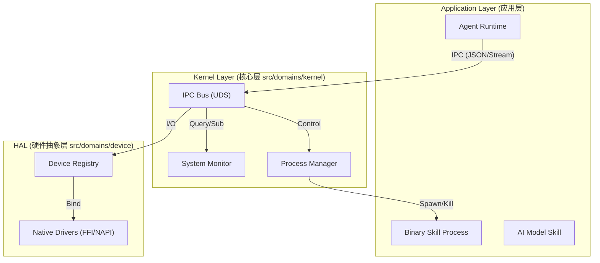
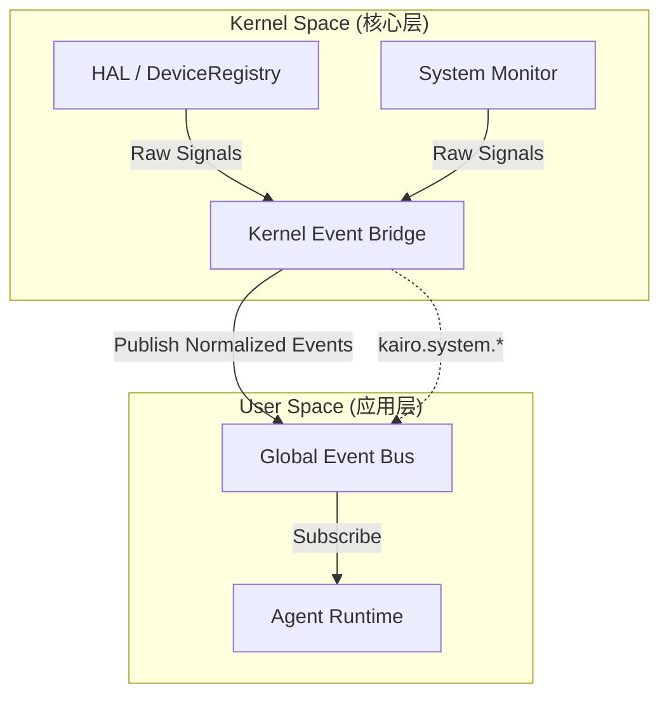

# Kairo Agent OS 技术规范 (Technical Specification)

## 1. 架构设计 (Architecture Design)

### 1.1 系统分层
系统将严格遵循微内核设计原则，分为以下层次：



### 1.2 目录结构规划
```
src/domains/
├── kernel/                 # [NEW] 内核核心服务
│   ├── system-info.ts      # 系统状态监控
│   ├── process-manager.ts  # 进程生命周期管理
│   └── ipc-server.ts       # UDS IPC 服务端
├── device/                 # [NEW] 硬件抽象层
│   ├── registry.ts         # 设备注册表
│   ├── monitor.ts          # 热插拔监听 (udev/IOKit)
│   ├── protocols/          # 标准协议定义
│   │   ├── serial.ts
│   │   └── gpio.ts
│   └── drivers/            # 原生驱动实现
└── skills/                 # [EXISTING] 技能管理
    ├── binary-runner.ts    # [NEW] 二进制技能运行器
    └── manifest.ts         # [UPDATE] 增强的技能清单定义
```

---

## 2. 核心层规范 (Kernel Specs)

### 2.1 System Monitor
负责采集宿主机状态，提供给 Agent 决策。

**Interface:**
```typescript
interface SystemMetrics {
  cpu: {
    usage: number; // 0-100
    temperature?: number;
  };
  memory: {
    total: number;
    used: number;
    free: number;
  };
  battery?: {
    level: number;
    charging: boolean;
  };
}

interface ISystemMonitor {
  getMetrics(): Promise<SystemMetrics>;
  subscribe(event: 'critical_battery' | 'high_load', callback: () => void): void;
}
```

### 2.2 Process Manager (Kairo Proc)
负责管理由 Agent 启动的“技能进程”。

**功能要求:**
*   **PID 映射**: 维护 Kairo 内部 ID 到 OS PID 的映射。
*   **资源限制**: 集成 `cgroups` (Linux) 或 `setrlimit` (macOS) 限制 CPU/内存。
*   **生命周期**: 支持 `spawn`, `kill`, `pause`, `resume`。

---

## 3. 硬件抽象层规范 (HAL Specs)

### 3.1 Device Registry
统一管理所有物理接口。

**Data Structures:**
```typescript
type DeviceType = 'serial' | 'camera' | 'audio_in' | 'audio_out' | 'gpio';

interface DeviceInfo {
  id: string;          // 内部唯一ID (e.g., "dev_serial_01")
  type: DeviceType;
  path: string;        // 物理路径 (e.g., "/dev/ttyUSB0")
  hardwareId: string;  // VID:PID 或 序列号
  status: 'available' | 'busy' | 'error';
  metadata: Record<string, any>;
}
```

**Semantic Mapping Rules (语义映射):**
系统维护 `config/devices.json` 规则表，将硬件 ID 映射为语义别名：
```json
{
  "mappings": [
    {
      "vid": "0403",
      "pid": "6001",
      "alias": "sensor_hub_main"
    }
  ]
}
```
当设备插入时，`DeviceManager` 自动将其注册为 `agent://device/sensor_hub_main`。

### 3.2 Standard Interfaces (标准接口)
所有驱动必须实现对应的标准接口。

**Serial Interface:**
```typescript
interface SerialPort {
  open(baudRate: number): Promise<void>;
  write(data: Uint8Array): Promise<void>;
  read(length?: number): Promise<Uint8Array>; // 或者通过 EventStream
  close(): Promise<void>;
  on(event: 'data', listener: (data: Uint8Array) => void): void;
}
```

---

## 4. 技能系统增强 (Enhanced Skills)

### 4.1 Skill Manifest (v2)
扩展现有的 Skill 定义，增加二进制、动态库、Wasm 和 OCI 容器支持。

```yaml
name: "sdr-scanner"
version: "1.0.0"
type: "hybrid"  # "script" | "binary" | "wasm" | "container" | "hybrid"
description: "Software Defined Radio Scanner"

# 资源构件定义 (Artifacts)
artifacts:
  # 1. 独立二进制 (Executable) - 由 ProcessManager 管理
  # 适用：高性能计算、硬件控制、现有 CLI 工具
  binaries:
    darwin-arm64: "./bin/scanner-daemon"
    linux-x64: "./bin/scanner-daemon"

  # 2. 动态链接库 (Shared Library) - 由 Runtime FFI 加载
  # 适用：极低延迟算法（OpenCV/TensorFlow）、数据流处理
  libraries:
    darwin-arm64: "./lib/libsignal.dylib"
    linux-x64: "./lib/libsignal.so"
    win32-x64: "./lib/signal.dll" # via Wine

  # 3. WebAssembly (Wasm) - 由 Wasm Runtime 沙盒执行
  # 适用：不受信任的插件、跨平台计算模块
  wasm: "./dist/module.wasm"

  # 4. OCI 容器编排 (Container Orchestration)
  # 适用：复杂微服务栈（如本地向量库 + 数据库 + API）
  # 机制：Agent 通过 Terminal Tool 执行 `podman-compose -f <compose_file> up`
  container_stack: "./compose.yaml" # 包含多服务定义的 Compose 文件

# 权限申请
permissions:
  - scope: "device"
    request: "serial"
    criteria: { "alias": "radio_dongle" }
  - scope: "network"
    request: "listen"
    port: 8080
  - scope: "kernel"
    request: "ebpf" # 允许注入 eBPF 探针
    description: "Monitor network packets"

# 接口定义 (IPC)
interfaces:
  ipc: "unix-socket"
  socket_path: "/tmp/kairo-sdr.sock"
```

### 4.2 执行运行时 (Execution Runtimes)
系统提供多种运行时以支持上述构件：

1.  **Binary Runner**:
    *   `spawn()` 启动独立进程。
    *   通过 stdin/stdout 或 UDS 通信。
    *   使用 Cgroups 限制资源。

2.  **FFI Loader**:
    *   `dlopen()` 加载动态库到 Agent 进程空间。
    *   提供 JS <-> C 数据类型映射 (Buffer, Pointer)。

3.  **Wasm Sandbox**:
    *   集成 `wasmtime` 或 V8 Wasm 引擎。
    *   提供 WASI (WebAssembly System Interface) 系统调用模拟。

4.  **Container Orchestrator**:
    *   **非自动托管**: 内核不直接托管容器生命周期。
    *   **Terminal 驱动**: Agent 使用终端工具 (`podman`, `podman-compose`) 来启动、停止和管理容器栈。
    *   **资源映射**: 自动将 Skill 目录挂载到容器中，并注入必要的环境变量。

---

## 5. 通信协议 (Communication)

### 5.1 Kernel IPC (Native)
为了高性能，内核与 Agent 之间不使用 HTTP/JSON-RPC，而是使用基于 **Unix Domain Socket** 的流式协议。

**协议头 (Header):**
*   `Magic`: 0xKA
*   `Version`: 1 byte
*   `Type`: 1 byte (0x01: Request, 0x02: Response, 0x03: Event, 0x04: StreamChunk)
*   `Length`: 4 bytes (Payload length)

**Payload:**
*   控制平面 (Control Plane): MsgPack 序列化的命令对象。
*   数据平面 (Data Plane): 原始二进制流 (如摄像头帧数据)。

---

## 6. 事件系统集成 (Event System Integration)

为了将底层的内核事件（如硬件插拔、系统告警）与应用层（Agent/Skill）无缝连接，系统将采用**双层事件总线桥接架构**。

### 6.1 架构设计


### 6.2 核心组件
1.  **Kernel Event Bridge (`src/domains/kernel/bridge.ts`)**:
    *   作为内核与全局总线的中介。
    *   监听底层 Node.js/Bun 原生事件或 IPC 信号。
    *   将底层信号标准化为 `KairoEvent` 并发布到 `GlobalBus`。

2.  **Agent Runtime 增强**:
    *   修改 `mapEventToObservation` 逻辑。
    *   增加对 `kairo.system.*` 事件的解析，将其转化为 `Observation` 存入 Context。

### 6.3 事件命名规范 (System Events)
所有内核产生的事件必须遵循 `kairo.system.<module>.<action>` 格式。

| 事件 Topic | 触发源 | 数据载荷 (Payload) 示例 |
| :--- | :--- | :--- |
| `kairo.system.device.connected` | HAL / DeviceRegistry | `{ "id": "dev_01", "type": "camera", "path": "agent://camera/face_cam" }` |
| `kairo.system.device.disconnected` | HAL / DeviceRegistry | `{ "id": "dev_01" }` |
| `kairo.system.power.critical` | SystemMonitor | `{ "level": 5, "status": "discharging" }` |

### 6.4 交互示例
1.  **物理层**: USB 摄像头插入。
2.  **HAL**: `DeviceRegistry` 识别设备并触发内部事件。
3.  **Bridge**: 捕获事件，发布 `kairo.system.device.connected`。
4.  **Agent**: Runtime 收到事件，存入 Memory Context。
5.  **AI**: Agent 在下一次思考时“看到”设备接入，决定调用相关 Skill 进行初始化。

---

## 7. 实施步骤建议

1.  **基础建设**:
    *   创建 `src/domains/kernel` 和 `src/domains/device` 目录。
    *   定义 `SystemInfo` 接口并实现基础的 CPU/Mem 读取 (使用 `node-os-utils` 或原生 `os` 模块)。

2.  **设备管理原型**:
    *   引入 `usb-detection` 或类似库实现设备插拔监听。
    *   实现简单的 `DeviceRegistry`。

3.  **技能升级**:
    *   修改 `Skill` 类型定义，加入 `binary` 支持。
    *   实现一个简单的 `BinaryRunner` (先支持本地路径，后支持下载)。
